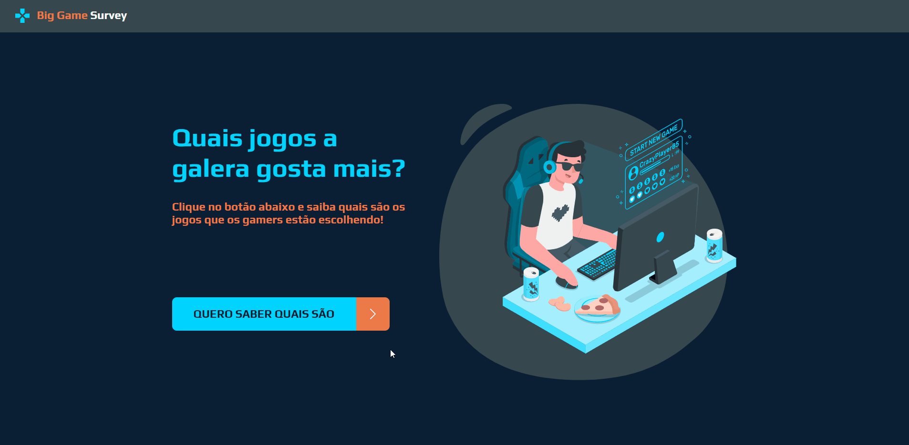
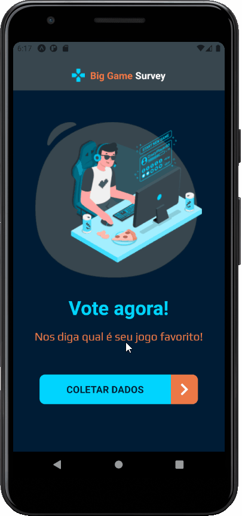

This application allows users to share their most loved games with other people and see the ranking of the games.
The credits for the app goes to DevSuperior week that provided the knowledge to creating this app.

  
  

---

# Netlify link: [Official site](https://survey-rogeriobento.netlify.app/)

---

## 🚀 Technologies

This project was developed with the following technologies:

- ✔️ Java 11

- ✔️ SpringBoot 2.3.3.RELEASE

- ✔️ Spring Data JPA

- ✔️ Spring Web

- ✔️ Spring Security

- ✔️ Typescript

- ✔️ React

- ✔️ React Native

- ✔️ NodeJS

- ✔️ React Hooks

- ✔️ PostgreSQL

- ✔️ Axios

Follow my [Linkedin Profile](https://www.linkedin.com/in/-rogerio-bento/)
